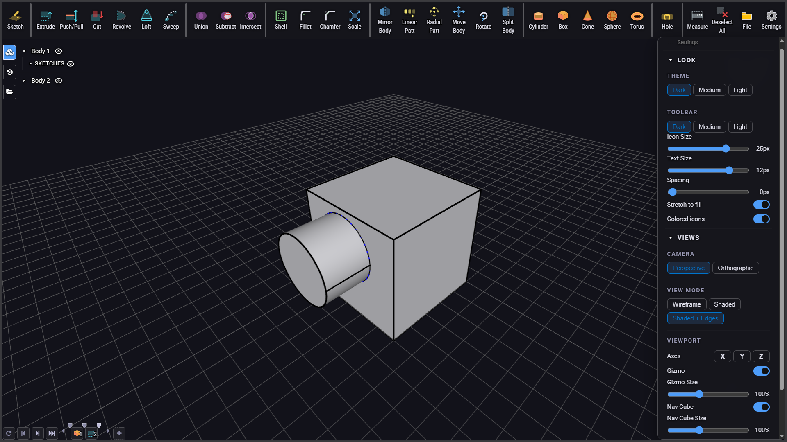
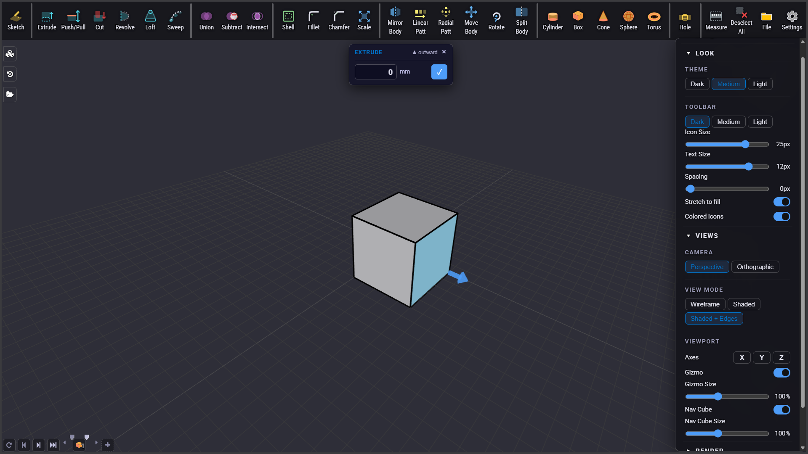
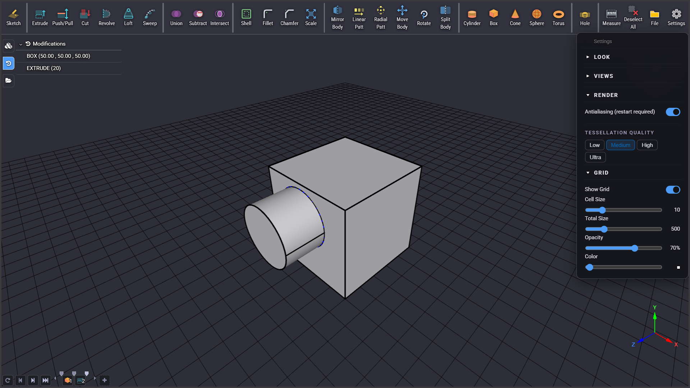
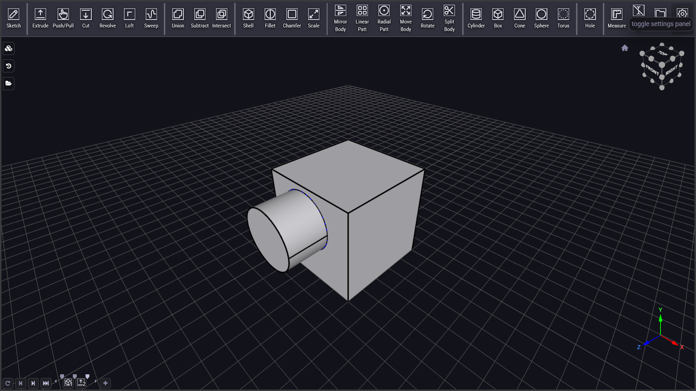
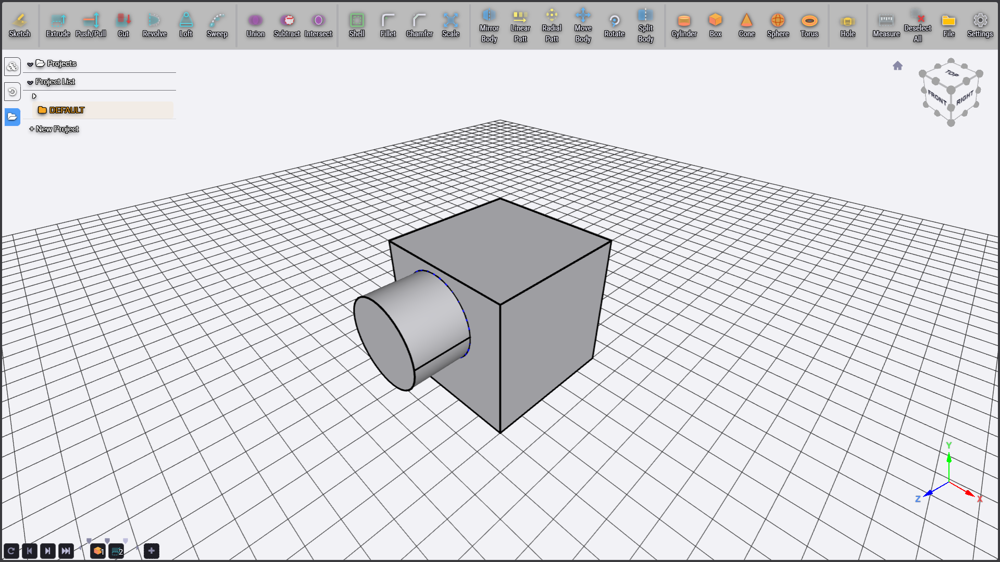
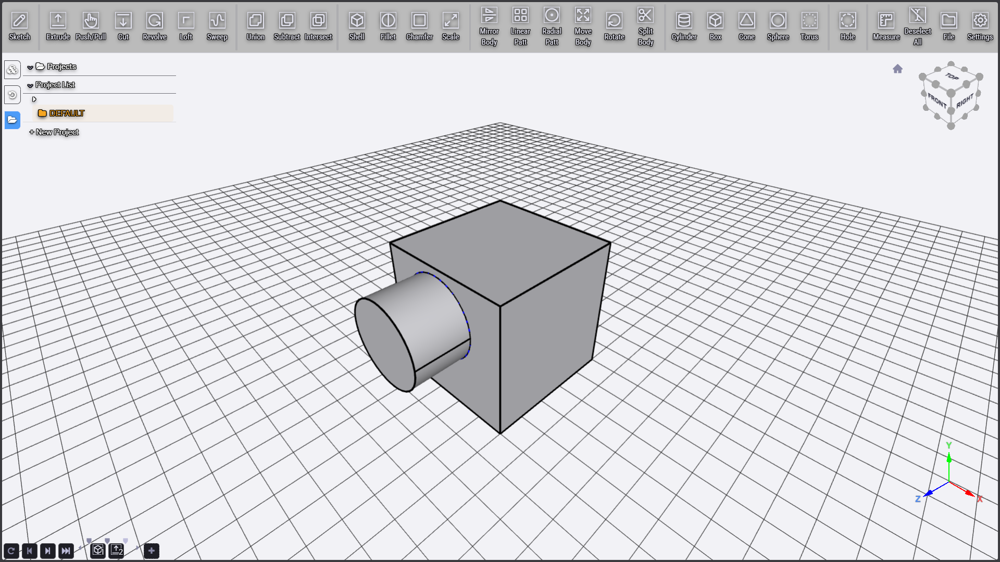
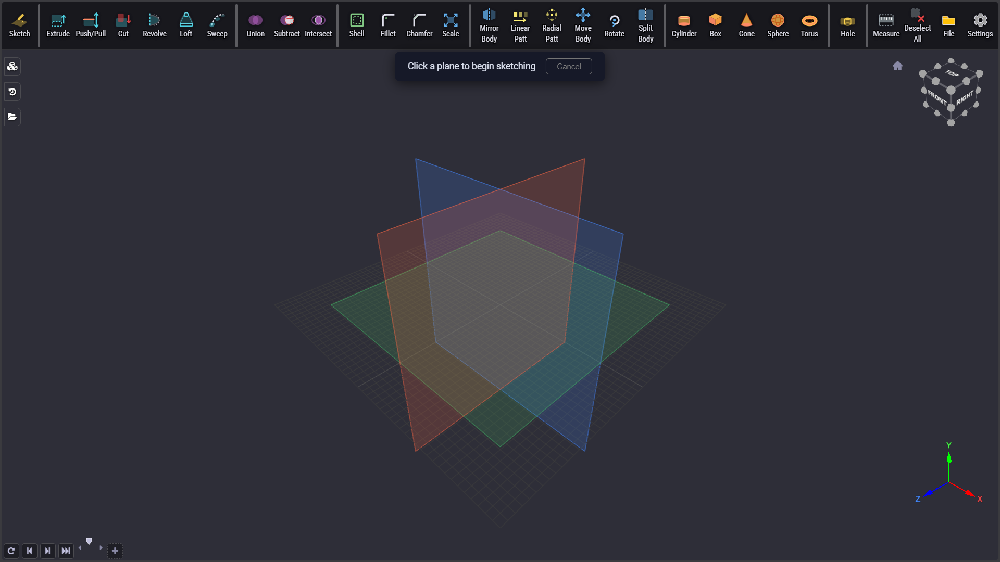
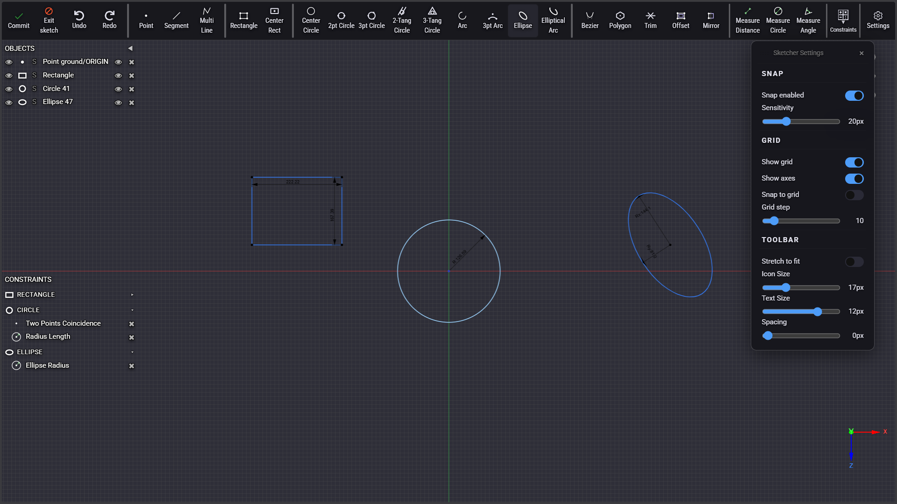
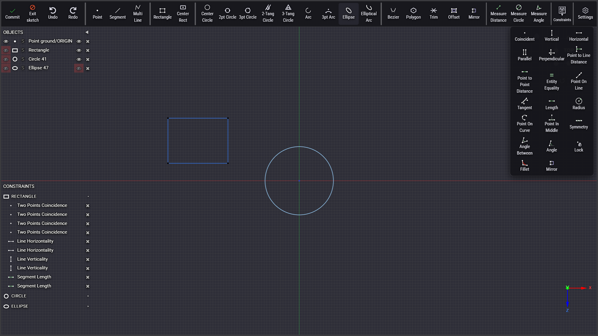

# ArcCAD

> **Beginner-friendly parametric CAD in your browser.** A fork of [jsketcher](https://github.com/xibyte/jsketcher) with enhanced UI/UX, modern tools, and streamlined workflow.


<table>
  <tr>
    <td></td>
    <td></td>
    <td></td>
  </tr>
  <tr>
    <td></td>
    <td></td>
    <td></td>
  </tr>
  <tr>
    <td></td>
    <td></td>
    <td></td>
  </tr>
</table>

---

## Table of Contents

- [Overview](#overview)
- [What's New](#whats-new)
- [Screenshots](#screenshots)
- [Features](#features)
- [Quick Start](#quick-start)
- [Tech Stack](#tech-stack)
- [License](#license)

---

## Overview

ArcCAD is a browser-based parametric 2D/3D CAD application built with React, Three.js, and OpenCascade WASM. It enables creating precise mechanical designs directly in the browser with real-time constraint solving and solid modeling capabilities.

**Key philosophy:** Simple, approachable, and powerful enough for beginners while maintaining professional capabilities.

---

## What's New

This fork transforms the original jsketcher with significant UI/UX improvements, new tools, and codebase cleanup.

### 🎨 UI & Layout Enhancements

| Feature | Description |
|---------|-------------|
| **Toolbar System** | Complete redesign with dark/medium/light themes and colored/mono icon options |
| **FloatView Sidebar** | Transparent overlay panels for History, Scene Tree, and Projects with CSS variable-based layout |
| **Draggable Settings** | Settings panel can be dragged and positioned anywhere |
| **Contextual Controls** | Fixed right-edge panel showing available actions and constraint participation on selection |
| **Constraints Dropdown** | 3-column grid layout that flips up when near screen bottom |
| **Side Panels** | Collapsible Objects and Constraints panels on the left edge |
| **Sketch Grid** | Canvas-drawn grid with visibility toggle (default: visible=true, snap=false, step=10) |

### 🛠️ New Tools & Features

| Category | Feature | Description |
|----------|---------|-------------|
| **Solid Tools** | Move Body | Translate bodies in 3D space |
| | Rotate Body | Rotate bodies around axis |
| | Split Body | Split bodies using sketch profiles |
| | **Measure Tool** | Measure distances and angles between points, edges, and faces |
| | **Push/Pull** | Click any face to extrude/pull; Click edge to fillet (+) / chamfer (−) |
| | **Sketch on Plane** | Start sketch on any face with on-screen plane selection handles |
| **Direct Edit** | **Draggable HUD** | Direct edit handles can be repositioned on screen |
| | **Right-click Pan** | Pan view without cancelling active handles |
| **WASM** | Smooth Spheres | Improved tessellation for curved surfaces |
| | STEP Export | Export to STEP format for manufacturing |
| | STL Export | Export to STL for 3D printing |
| **Navigation** | True 3D Pan | Screen-space panning using `right = eye × up`, `screenUp = right × eye` |

### ✏️ Sketcher Improvements

| Feature | Description |
|---------|-------------|
| **Persistent Tool Mode** | Tools stay active after placing each shape (toggle off by clicking again) |
| **ESC Cancellation** | Two-stage ESC: 1st cancels current shape, 2nd exits tool |
| **Live Angle Hints** | Shows angle near cursor while drawing segments |
| **Dimension Input** | Floating input box near cursor with fields for R, L, W/H, D, Rx/Ry, A° |
| **Constraint Editing** | Click constraint in panel OR double-click annotation to edit values |
| **Rectangle Groups** | 4 segments grouped as one logical "Rectangle" object |
| **Trim Tool** | Highlights hovered segment + red overlay preview of portion to be removed |
| **Object Visibility** | Eye icon toggles visibility recursively on children |
| **Sketcher Settings Panel** | Dedicated settings for sketch mode with grid, snap, and display options |

### 🔧 Technical Improvements

| Area | Changes |
|------|---------|
| **CSS Variables** | All toolbar sizing driven by CSS custom properties (`--toolbar-icon-size`, `--toolbar-text-size`, `--toolbar-spacing`) |
| **Pointer Events** | `.mainLayout` uses `pointer-events: none` with explicit `pointerEvents: 'auto'` on interactive panels |
| **Coordinate Handling** | Fixed `screenToModel(e)` to properly read `e.offsetX` / `e.offsetY` |
| **Snap Handling** | Fixed `viewer.snapped` to prevent snap pollution and degenerate shapes |
| **Selection Priority** | EDGE beats FACE in selection order |

### 🧹 Codebase Cleanup

| Removed | Reason |
|---------|--------|
| RoutingElectrical Workbench | Unused, 30+ files |
| Debug Bundle | Development-only code |
| Sandbox Tests | Auto-runs on load, now disabled |
| Standalone 2D Sketcher | Removed separate entry point, kept in-place sketching |
| sketchFace2D() function | Opened sketcher in new tab, not needed |

---

## Features

### 3D Workspace
- **Solid Tools**: Move Body, Rotate Body, Split Body, **Measure Tool**
- **Direct Edit**: **Click face to push/pull**, click edge to fillet/chamfer
- **Sketch on Plane**: **On-screen plane selection** — click any face to start sketching
- **WASM-Powered**: OpenCascade kernel with STEP/STL export
- **Themes**: Dark, Medium, Light with colored or monochrome icons
- **Settings Panel**: Draggable panel with:
  - **Look**: Theme (Dark/Medium/Light), Toolbar customization (background, icon/text size, spacing, stretch, colored icons)
  - **Views**: Camera (Perspective/Orthographic), View Mode (Wireframe/Shaded/Shaded+Edges), Viewport (Axes toggle, Gizmo + Nav Cube with size controls)
  - **Render**: Antialiasing toggle, Tessellation Quality (Low/Medium/High/Ultra)
  - **Grid**: Show/hide, Cell Size, Total Size, Opacity, Color
- **Navigation**: True screen-space 3D panning

### 2D Sketcher
- **Drawing Tools**: Line, Rectangle, Circle variants, Arc, Ellipse, Bezier, Polygon
- **Editing Tools**: Trim, Offset, Mirror
- **Constraints**: Full constraint system with parametric solving
- **UI Features**:
  - Persistent tool mode (tool stays active after placing shape)
  - ESC cancellation with undo support
  - Live angle hints while drawing
  - Floating dimension input near cursor
  - Contextual controls panel
  - Collapsible objects & constraints panels
- **Rectangle Groups**: 4 segments grouped as one logical object

### Project Management
- Scene tree with hierarchy
- Project manager
- History/undo tracking

---

## Quick Start

### Download & Run (Recommended)

1. Go to the [**Releases page**](https://github.com/Pesicp/ArcCAD/releases)
2. Download the latest release zip file
3. Extract the zip to any folder
4. Open a terminal in that folder and run:

```bash
npm start
```

5. Open http://localhost:3000 in your browser

> **Note:** The first run will prompt to install `serve`. Type `y` and press Enter.

---

### Development

If you want to build from source:

```bash
npm install
npm start
```

Then open http://localhost:3000

### Production Build

```bash
npm run build
```

Output is in `dist/` folder. Deploy contents to any static web server.

---

## Tech Stack

| Component | Technology |
|-----------|------------|
| Frontend | React 16, JSX |
| 3D Rendering | Three.js |
| CAD Kernel | OpenCascade (WASM) |
| Bundler | Webpack 5 |
| Language | JavaScript + TypeScript |
| Styling | LESS/CSS |

---

## License

This project is licensed under a custom license. See [LICENSE](./LICENSE) for details.

For commercial licensing options, visit: https://www.autodrop3d.com/parametric-cad-beta.html

---

## Acknowledgments

- Original [jsketcher](https://github.com/xibyte/jsketcher) by [Val Erastov](https://github.com/xibyte) — the foundation for parametric CAD in the browser
- OpenCascade geometric kernel
- Three.js community
